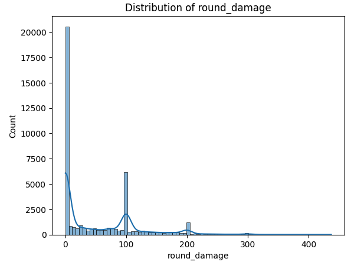
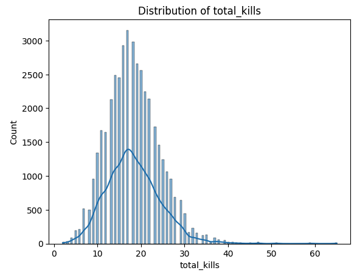
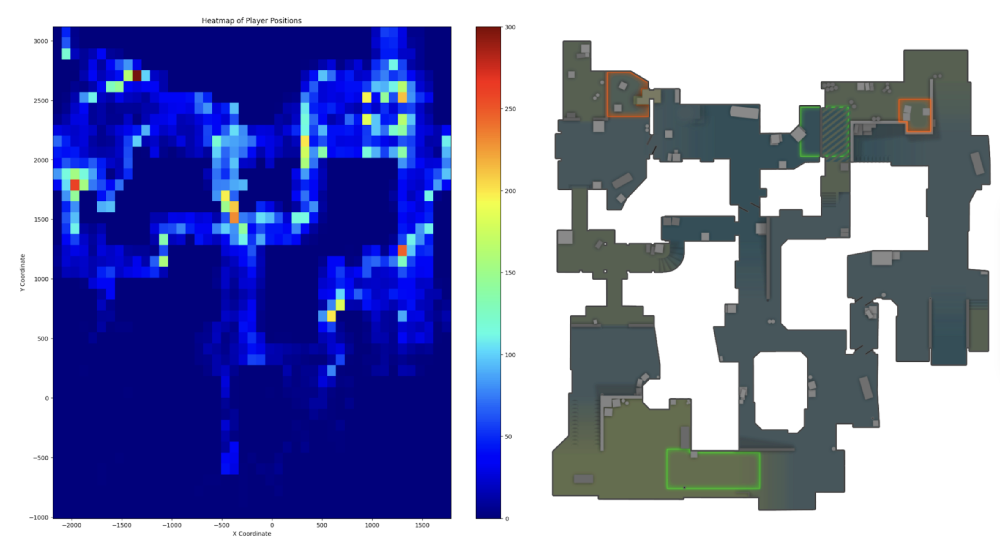
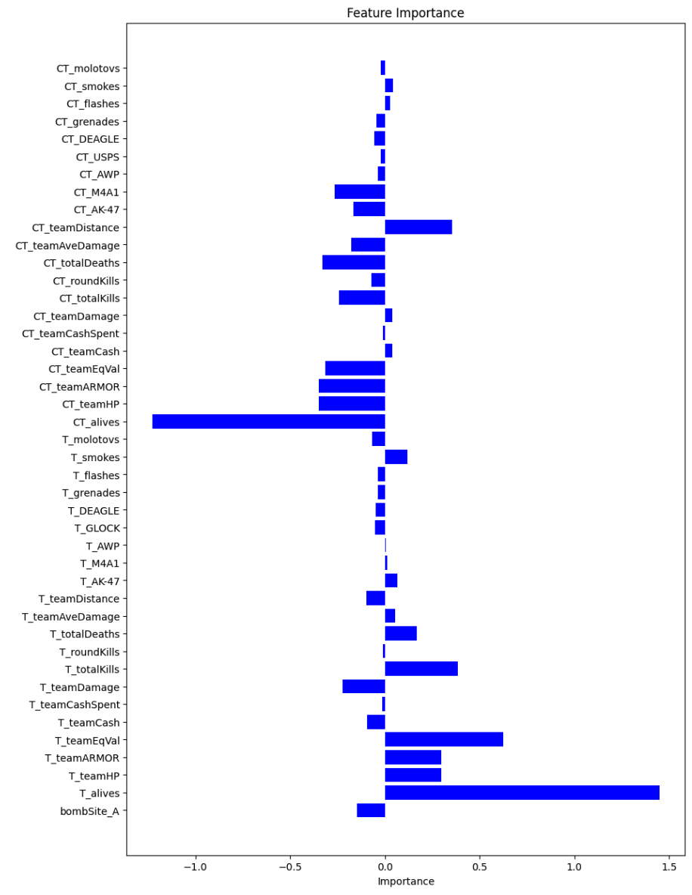
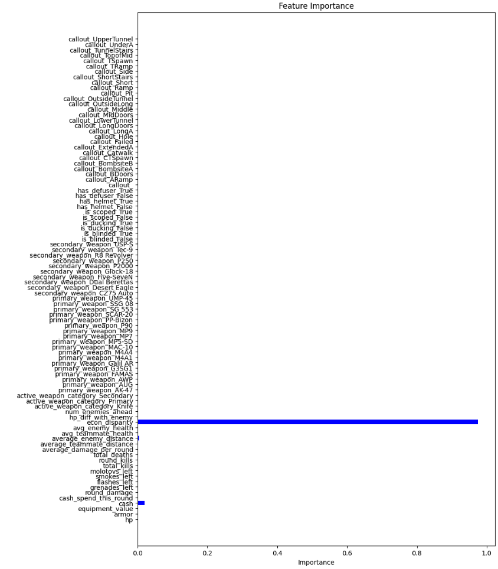
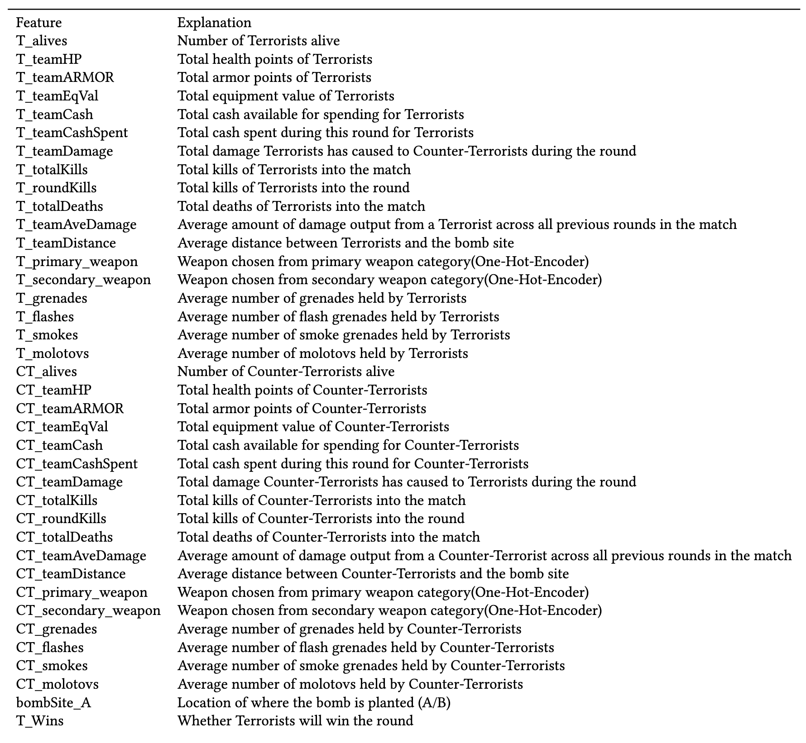
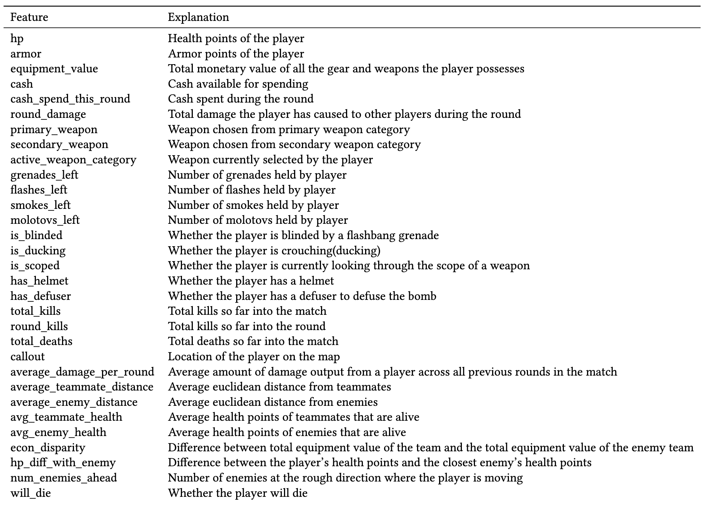

<!-- 

 -->

    
<b>Figure 1:</b> Distribution of Round Damage

    

    
<b>Figure 2:</b> Distribution of Total Kills

    

    
<b>Figure 3:</b> Death Location

    

    
<b>Figure 4:</b> Feature Importance of Logistic Regression for Round Result Prediction

    

    
<b>Figure 5:</b> Feature Importance of Decision Tree for Player Death Prediction

    

    
<b>Figure 6:</b> Feature Importance of XGBoost for Player Death Prediction

    

